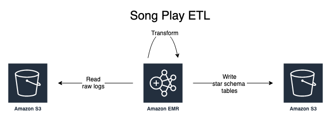

# PySpark ETL pipeline using AWS EMR and AWS S3

Extract song play activity from logs stored on [AWS S3](https://aws.amazon.com/emr/) and transform them into a star schema consisting of a central fact table (songplay) and related dimension tables (song, artist, user, time) using [PySpark](https://databricks.com/glossary/pyspark) running on [AWS EMR](https://aws.amazon.com/emr/).  

## Purpose

Sparkify -- a fictitious startup -- wants to analyze the data they have been collecting on songs and user activity form their new music streaming app. They are particularly interested in finding out what songs are user's are listening to. Their data is stored JSON logs files and needs to be analyzed in order to find out.  They want to create a database optimized to analyze user's listening behavior. To perform this analysis routinely they need a database schema and an extract-transform-and-load (ETL) pipeline.

## Design



What songs are users's listening to?  To answer this question I will need to create an extract-transform-and-load pipeline to restructure the Sparkify data.  Log files are gathered from subscriber activities by Sparkify's online transactional processing (OLTP) system and written to AWS S3 storage.  Star schemas are commonly used in data warehouses applications to support online analytical processing systems (OLAP) needs.  PySpark code running a AWS EMR cluster is used to transform the raw JSON logs into star schemas simplifying analytic queries.

## File Descriptions

1. `etl.py` -- _Extracts_ data from the raw logs stored on AWS S3, _transforms_ them using PySpark code and _loads_ the resulting fact and dimension tables back onto AWS S3 for analysis.  

1. `dl.cfg` -- Configuratio file containing paths song data, event logs and the output directory where to write the normalized star-schema tables.  Access credentials for AWS are also stored here __so don't store this file on Github__.

1. `data` -- Sample data for running locally with subdirectories for `song_data` and `log_data`.


## Usage

Command line interface enables this program to be run locally or on AWS.  Paths to the top-level data files must first be entered in .env/dl.cfg file.  This file is not part of the repository because it contains AWS keys.  Here is an example for you to follow:

```text
[AWS]
AWS_ACCESS_KEY_ID=your-key-here
AWS_SECRET_ACCESS_KEY=your-secret-key-here
SONG_DATA=s3a://udacity-dend/song_data/
LOG_DATA=s3a://udacity-dend/log_data/
OUTPUT_DATA=s3://song-play-spark/

[LOCAL]
SONG_DATA=data/interim/song_data/
LOG_DATA=data/interim/log_data/
OUTPUT_DATA=data/interim/processed/
```

* Locally -- Enter `python etl.py --local`

* AWS EMR -- Enter `python etl.py --aws`

## Citations

1. [PySpark SQL Module Documentation](https://spark.apache.org/docs/2.1.0/api/python/pyspark.sql.html#pyspark.sql.DataFrame) -- Essential documentation for understanding the PySpark API.

1. [Removing duplicate columns after a DF join in Spark](https://stackoverflow.com/questions/46944493/removing-duplicate-columns-after-a-df-join-in-spark) - Solution to duplicate column name resulting from a join is to either:

    * join using a list `df1.join(df2, ['id']).show()` joining on the common `id` column
    * leave the columns named indendically and provide an alias for each table:
    `df1.alias("a").join(df2.alias("b"), df1['id'] == df2['id']).select("a.id", "a.val1", "b.val2").show()`

1. [Apache PySpark by Example](https://www.lynda.com/Spark-DataFrames-tutorials/Apache-PySpark-Example/802868-2.html) -- An excellent and short introduction to using PySpark for data analysis.  Available for free through most public libraries.  

1. [](https://spark.apache.org/docs/2.1.0/api/python/index.html#) - Excellent documentation of the API and examples of how to use it.
